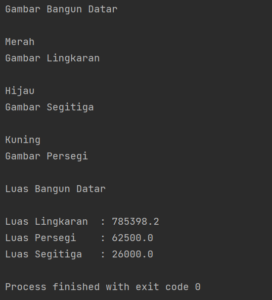

# PRAKTIKUM6
## Pemrograman Orientasi Objek

````shell
Nama   : Ikram Ramadhan
Nim    : 312110478
Matkul : Pemrograman Orientasi Objek
````


### 1. File BangunDatar.java
* *CODINGAN FILE 1

```java
package Pertemuan10;

// Abstrak class Bangun Datar
public abstract class BangunDatar {
    // Atribute Warna
    String warna;

    // Constructor Bangun Datar
    public BangunDatar (String warna){
        this.warna = warna;
    }

    //SETTER
    public void setWarna(String warna) {
        this.warna = warna;
    }
    //GETTER

    public String getWarna() {

        return this.warna;
    }

    // Abstract Method
    public abstract void draw();

    public abstract float luas();

}

```

### 2.Lingkaran.java
* *CODINGAN FILE 2
```java
package Pertemuan10;

//Inherite Dari Bangun Datar
public class Lingkaran extends BangunDatar {
    // Atribute Lingkaran
    private final int r;

    // Overload constructor
    public Lingkaran(String warna,int r) {
        super(warna);
        this.r = r;
    }

    // Abstract Methode draw
    @Override
    public void draw() {
        System.out.println("Gambar Bangun Datar");
        System.out.println("\n" + getWarna());
        System.out.println("Gambar Lingkaran");
    }
    // Abstract Method luas
    public float luas() {
        System.out.println("Luas Bangun Datar");
        return (float) (Math.PI * r *r);
    }

}
```
### 3.Persegi.java
* *CODINGAN FILE 3
```java
package Pertemuan10;

// Inherite Dari Bangun Datar
public class Persegi extends BangunDatar {
    // Atribute
    private final float panjang;
    private final float lebar;

    //Overloading constructor
    public Persegi(String warna,float panjang, float lebar) {
        super(warna);
        this.panjang = panjang;
        this.lebar = lebar;

    }

    //Overide Abstract Method draw
    @Override
    public void draw() {
        System.out.println("\n"+getWarna());
        System.out.println("Gambar Persegi");
    }

    //Overloading Abstract Method luas
    @Override
    public float luas() {

        return (panjang * lebar);
    }
}
```
### 4.Segitiga.Main.java
* *CODINGAN FILE 4
```java
package Pertemuan10;

// Inherite Dari Bangun Datar
public class Segitiga extends BangunDatar{
  //Atribute 
  private final int alas;
  private final int tinggi;

  // Overloading constructor
  public Segitiga(String warna,int alas, int tinggi) {
    super(warna);
    this.tinggi = tinggi;
    this.alas = alas;

  }
  // overriding Abstract method draw 
  @Override
  public void draw() {
    System.out.println("\n"+getWarna());
    System.out.println("Gambar Segitiga");
  }
  //overriding Abstract method luas
  @Override
  public float luas() {
    return (float) (0.5 * alas * tinggi);
  }
}

```
### 5.Main.Main.java
* *CODINGAN FILE 5
```java
package Pertemuan10;

//Call Method
public class Main {
  public static void main(String[] args) {

    //Pembuatan object dari Subclass dengan polymorphic tipe data BangunDatar

    BangunDatar lingkaran =new Lingkaran("Hitam",500);
    BangunDatar persegi =new Persegi("Kuning",250,250);
    BangunDatar segitiga= new Segitiga("Hijau",200,260);

    //Pengubahan warna dengan setter
    lingkaran.setWarna("Merah");

    //Pemanggilan Abstract Method draw
    lingkaran.draw();
    segitiga.draw();
    persegi.draw();

    //Pemanggilan Abstract Method luas
    System.out.println();
    System.out.println("\nLuas Lingkaran\t: " + lingkaran.luas());
    System.out.println("Luas Persegi\t: " + persegi.luas());
    System.out.println("Luas Segitiga\t: " + segitiga.luas());


  }
}

```

* *Hasil output program:*
  
